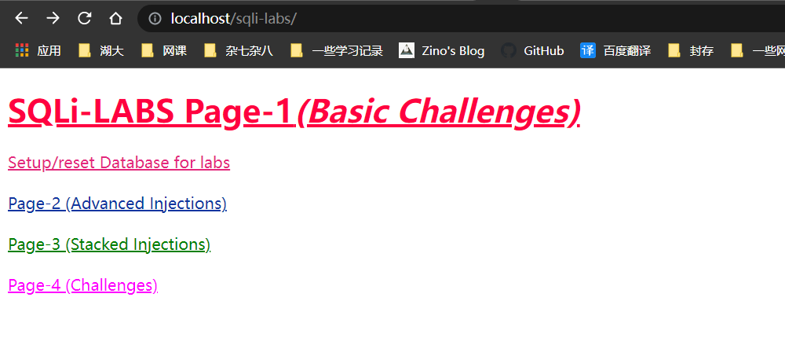
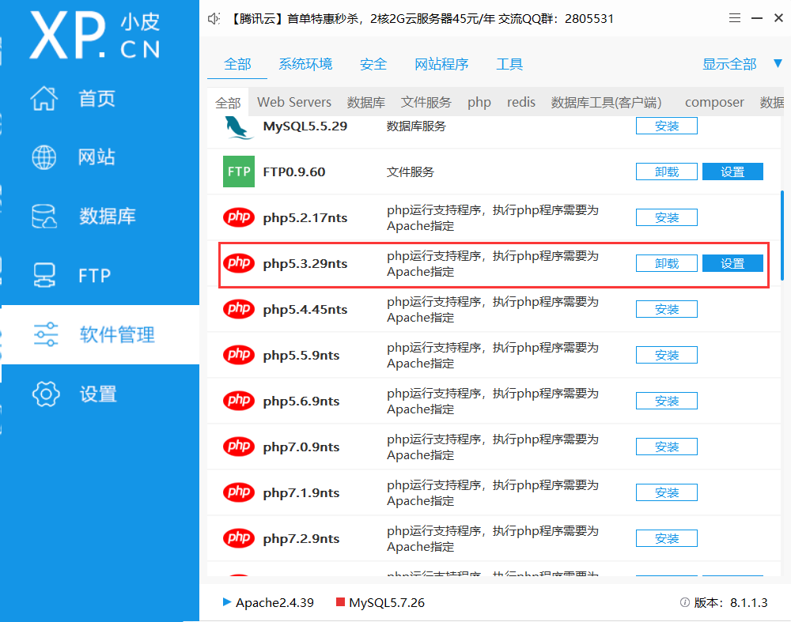
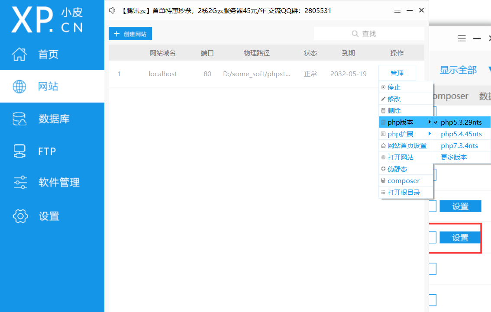
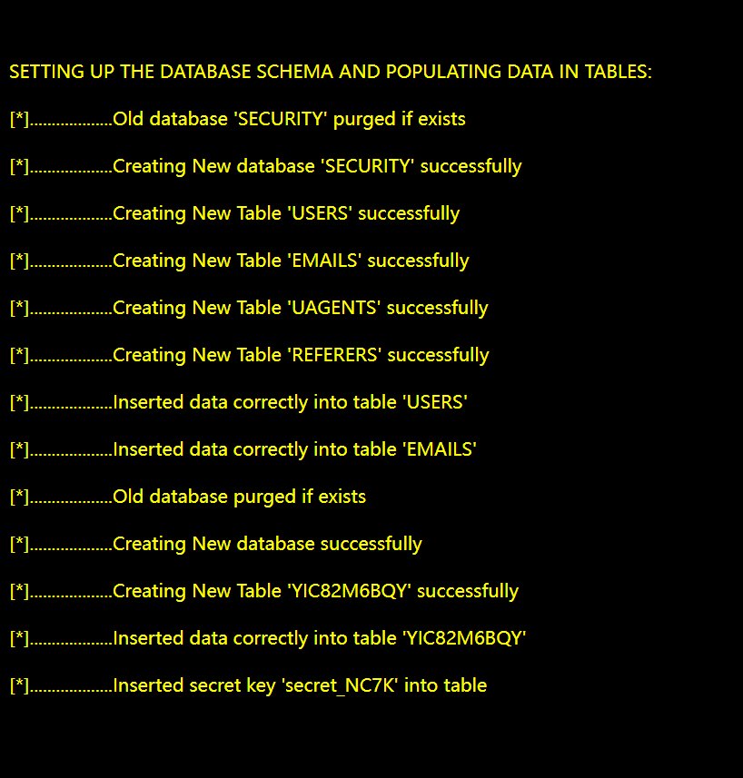

## SQLI-LABS靶场搭建

### 1.安装下载

SQLiLabs源码下载： https://github.com/Audi-1/sqli-labs
使用phpstudy搭建:  https://www.xp.cn/
phpStudy是一个PHP调试环境的程序集成包。


### 2.配置

将之前下载的源码解压到phpstudy安装目录下的www目录下，修改sql-connections/db-creds.inc文件当中的mysql账号密码！默认的mysql数据库地址是“127.0.0.1 或 localhost”，用户名和密码都是”root”。主要是修改’$dbpass参数并保存

```php
<?php

//give your mysql connection username n password
$dbuser ='root';
$dbpass ='root';
$dbname ="security";
$host = '127.0.0.1';
$dbname1 = "challenges";

?>
```

打开浏览器http://localhost/sqli-labs/  访问首页，并点击“Setup/reset Database”以创建数据库，创建表并填充数据



### 3.bug解决

#### php版本问题

点击Setup/reset Database是遇到问题，显示报错


原因是php版本太高，mysql_connect已经被弃用，所以我们需要在phpstudy中后选用php5.3.29



然后在网站选项中选择php5.3.29



#### phpstudy里的mysql和本地冲突

之后我们发现无法开启mysql服务，因为本机上已经有了一个mysql了，所以无法成功开启，通过下面的命令停止本机服务，并删除服务

```sh
net stop mysql80
sc delete mysql
```

现在可以成功开启phpstudy里的mysql

这时再点击就可以成功设置数据库了



下次要用本机的mysql，就通过下面的命令开启即可

```
net start mysql80 
```

